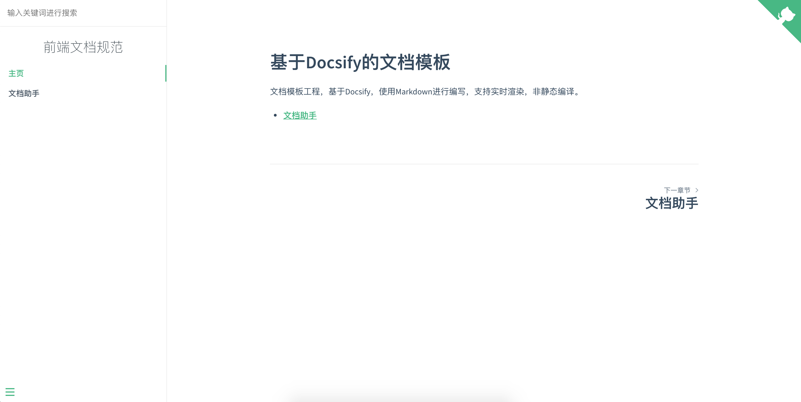

<div align="center">
    <h1>基于Docsify的文档模板</h1>
    <div>文档模板工程，基于Docsify，使用Markdown进行编写，支持实时渲染，非静态编译。</div>
    <br/>
    
</div>


**快速开始**
```bash
# 克隆文档仓库
git clone git@github.com:zhengxiangqi/TemplateForDocs.git TemplateForDocs

# 进入工程目录
cd TemplateForDocs

# 安装node依赖
npm install 或者 cnpm install 或者 yarn

# 启动文档
npm start
```


**文档预览**


